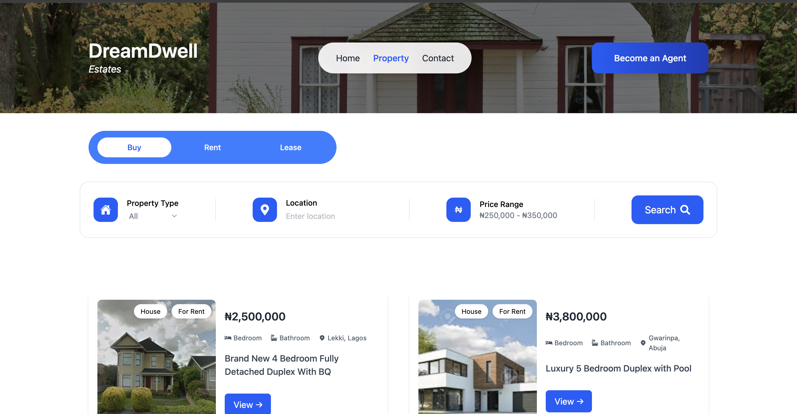

#  A Property Listing App

A modern and responsive real estate web application built with **React**, **Vite**, and **Tailwind CSS**. This app allows users to browse, search, and filter property listings based on location and property type, .

---

##  Project Setup Instructions

Follow the steps below to run the project locally:

```bash
# Clone the repository
git clone https://github.com/sirconfy/worksquare-frontend-task.git
cd worksquare-frontend-task
git checkout chidi_branch


# Install dependencies
npm install

# Start the development server
npm run dev
```

---

##  Tools & Libraries Used

- **React** – JavaScript library for building user interfaces.
- **Vite** – Fast development server and build tool.
- **Tailwind CSS** – Utility-first CSS framework for responsive styling.
- **AOS (Animate On Scroll)** – Library for adding  animations.
- **React Hooks** – `useState` and `useEffect` for managing component state and lifecycle.

---

## Architecture & Approach

This section explains the folder structure, state management strategy, and UI/UX choices.

###  Folder Structure

```
src/
├── assets/         # Static files like images and icons
├── components/     # Reusable UI components (e.g., PropertyCard, FilterBar, Header)
├── data/           # Static JSON data (e.g., property listings, filter options)
├── pages/          # Top-level views/pages (e.g., Home.jsx)
├── App.jsx         # Main App component
├── main.jsx        # Entry point of the application
```

###  State Management Method

The app uses **React’s built-in hooks**:

- `useState` to handle:
  - Search/filter values
  - Loading states
  - Toggle states
- `useEffect` for:
  - Initializing AOS
  - Reacting to filter or UI changes

Why? Because the application has simple, local component-based state that does not require a global state manager like Redux or Zustand. React Hooks provide a clean and efficient way to handle all state needs in this project.

---

##  UI/UX Decisions & Rationale

- **Tailwind CSS**: Enables rapid styling and consistency across components using utility classes.
- **Responsive Layout**: Uses grid and flex utilities to ensure the layout works seamlessly on mobile, tablet, and desktop.
- **AOS Animations**: Adds engaging scroll-based animations to enhance visual appeal and draw attention to listings.
- **Minimal Design**: Prioritized readability and user flow with clear sections and intuitive filtering.
- **Component-Based Design**: Components like `PropertyCard`, `FilterBar`, and `Footer` help maintain code reusability and cleanliness.

---

##  Notes About My Approach

- Started the project with `create-vite` for fast setup and zero-config development.
- Used a simple JSON file in the `data/` folder to simulate backend responses.
- Initialized `AOS` inside a `useEffect` hook in the main layout to enable animations.
- Used Tailwind’s mobile-first approach to build a responsive layout from the ground up.

---

##  Trade-offs & Areas for Improvement

| Area                      | Comment                                                                 |
|---------------------------|-------------------------------------------------------------------------|
| AOS Limitations           | Lightweight and easy to use, but lacks fine control over animations     |
| Static Data Source        | Uses local JSON – can be replaced with a real backend API              |
| No State Persistence      | State resets on refresh – could improve using Context or localStorage  |
| No Automated Testing Yet  | Adding Jest and React Testing Library would strengthen reliability     |

---

##  Screenshots

###  Home Page

> 

---

## Summary

This project showcases a clean, modern real estate listing app using React and Tailwind. It includes:

- A filterable property grid
- Responsive design
- Scroll-based animations
- Modular and scalable code structure

Perfect as a base for a full-featured real estate platform.

---

##  Author

**Chidi Confidence Obumneke*  


